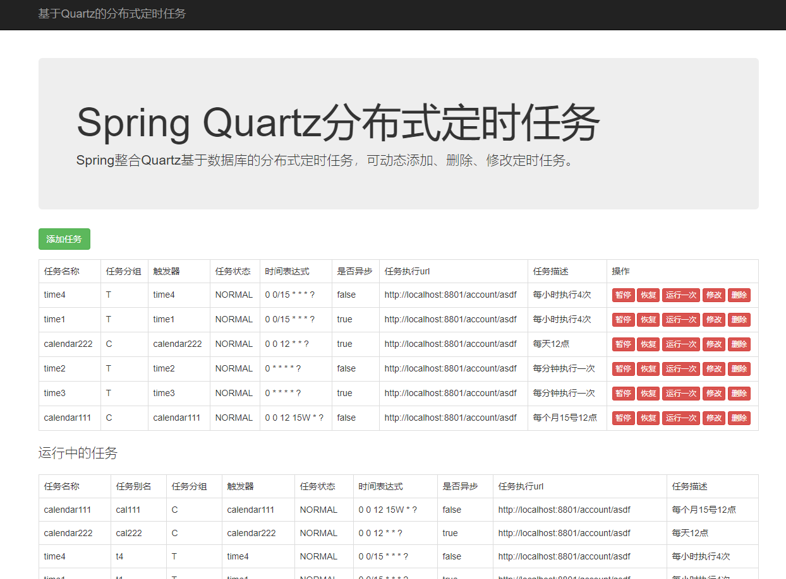
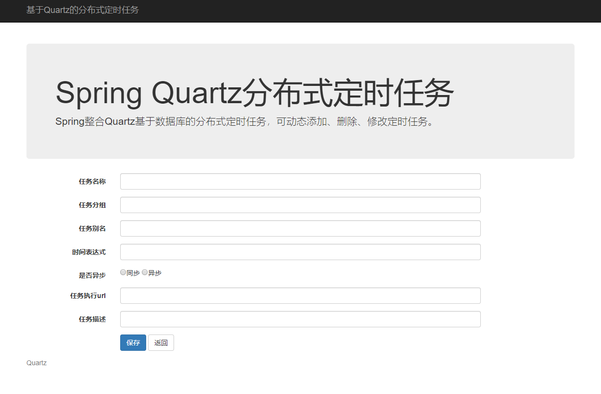

# spring-quartz-cluster-sample

Spring整合Quartz基于数据库的分布式定时任务，可动态添加、删除、修改定时任务。

## 创建quartz数据库

1. 执行src/main/resources/scripts下的建表语句  
(其中一条数据即可，idea中执行tables_cubrid.sql即可)

2. 执行src/main/resources/create-schema.sql语句

## 修改数据库连接信息
修改 jdbc.properties

# Screenshots

---

# 功能描述
## 暂停/恢复
点击暂定后，不执行任务  
点击恢复后，会将暂定中未执行的任务，在恢复的一瞬间全部执行
## 运行一次
运行一次任务，不影响原有的定时任务
## 修改
1. 删除运行中的任务
2. 创建新任务
3. 更新 schedule 表数据
## 删除
将数据库中表 schedule_job 数据中的 status = '0'
## 删除运行中的数据
1. qrtz_cron_triggers
2. qrtz_triggers
3. qrtz_job_details